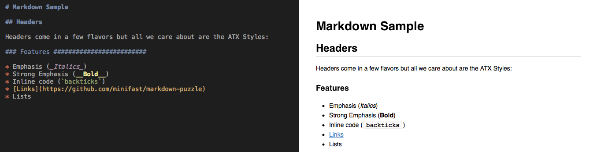

# Markdown

Markdown was written by John Gruber in 2004 as a text-to-HTML conversion tool with a highly readable syntax. In the following years, owing to the growth of the web, Markdown has seen adoption across many different domains, and may have replaced HTML for documentation purposes.

Markdown is free software, available under the terms of a BSD-style open source license: [LICENSE.MARKDOWN](LICENSE.MARKDOWN).


## Requirements

* Mac OS 10.11+
* XCode 7.3+
* [Carthage](https://github.com/Carthage/Carthage)
* Git


## Development Setup

0. Clone this repository to your local machine.
1. Run `carthage update --platform Mac`
1. Open `Markdown.xcproject`
2. Run all tests (⌘U)
3. Double-click on the test failure and make it pass.
4. Start writing Markdown!


## Goals

The immediate goal of this exercise is to render [SAMPLE.md](doc/SAMPLE.md) like this:

   


## Markdown Syntax

Let's review Markdown's syntax definition.  Due to Markdown's original goals – and the year when the syntax was specified – HTML is referenced.  Let's put that aside for just a minute.

> Parts of the following description come from <https://daringfireball.net/projects/markdown/syntax>, which is not a formal definition.  That lack of formality has resulted in many standardization efforts, such as CommonMark.  However, much like the original goal of the syntax itself, the result is extremely readable.


##### PARAGRAPHS AND LINE BREAKS

A paragraph is simply one or more consecutive lines of text, separated by one or more blank lines. (A blank line is any line that looks like a blank line — a line containing nothing but spaces or tabs is considered blank.) Normal paragraphs should not be indented with spaces or tabs.


##### ATX HEADERS

Atx-style headers use 1-6 hash characters at the start of the line, corresponding to header levels 1-6. For example:

```
    # This is an H1
    ## This is an H2
    ###### This is an H6
```

Optionally, you may "close" atx-style headers. This is purely cosmetic — you can use this if you think it looks better.

```
    ## This is an H2 ##
    ### This is an H3 ######
```


##### LINKS

To create an inline link, use a set of regular parentheses immediately after the link text’s closing square bracket. Inside the parentheses, put the URL where you want the link to point, along with an optional title for the link, surrounded in quotes. For example:

```
    This is [an example](http://example.com/) inline link.
```


##### EMPHASIS

Markdown treats asterisks (`*`) and underscores (`_`) as indicators of emphasis. Text wrapped with one `*` or `_` will be wrapped with an HTML `<em>` tag; double `*`'s or `_`'s will be wrapped with an HTML `<strong>` tag:

```
    *single asterisks = italics*
    _single underscores = italics_

    **double asterisks = bold**
    __double underscores = bold__
```

Emphasis can be used in the middle of a word:

```
    un*frigging*believable
```


##### CODE

To indicate a span of code, wrap it with backtick quotes (`). A code span indicates code within a normal paragraph. For example:

```
    Use the `printf()` function.
```


##### LISTS

Markdown supports ordered (numbered) and unordered (bulleted) lists.

Unordered lists use asterisks, pluses, and hyphens — interchangably — as list markers:

```
    *   Red
    *   Green
    *   Blue
```

Ordered lists use numbers followed by periods:

```
    1.  Bird
    2.  McHale
    3.  Parish
```


## Rich Text, Cocoa, and You

In order to make different Markdown elements have different fonts, colors, sizes, or decorations, we'll need to use [NSAttributedString](https://developer.apple.com/library/mac/documentation/Cocoa/Reference/Foundation/Classes/NSAttributedString_Class).  For example, in order to test that an NSAttributedString has the expected [NSFont](https://developer.apple.com/library/mac/documentation/Cocoa/Reference/ApplicationKit/Classes/NSFont_Class), we'll need to write the following test using Nimble:

```swift
func test_Markdown_rendersAPlainString() {
    let renderedString = Markdown(string: "Just some text").render()
    let font = rendered.attribute(NSFontAttributeName, atIndex: 0, effectiveRange: nil) as! NSFont
    expect(font.fontName) == "Menlo-Regular"
}
```


## Contributing

1. Fork it ( https://github.com/minifast/markdown-puzzle/fork )
2. Create your feature branch (`git checkout -b my-new-feature`)
3. Commit your changes (`git commit -am 'Add some feature'`)
4. Push to the branch (`git push origin my-new-feature`)
5. Create a new Pull Request
